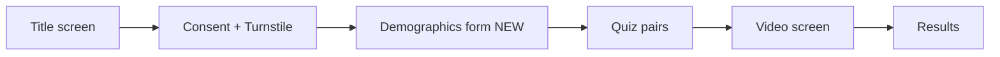

# Plan: Demographics Screen Before Quiz

## User flow



Demographics is gated between consent and the quiz. Submitting the form starts the quiz timer (i.e. `startQuiz()` runs after the form is submitted, not before).

## Fields (Standard, 5)

All single-select. Every field has a "Prefer not to say" choice so users can advance without revealing PII. Backend stores `null` for those.

- `age_band`: `under_18`, `18_24`, `25_34`, `35_44`, `45_54`, `55_64`, `65_plus`, `prefer_not`
- `education`: `less_than_hs`, `hs`, `some_college`, `bachelors`, `masters`, `doctorate`, `prefer_not`
- `native_english`: `yes`, `no`, `prefer_not`
- `gender`: `female`, `male`, `non_binary`, `self_describe`, `prefer_not`
- `ai_familiarity`: `never`, `sometimes`, `daily`, `prefer_not`

Validation: all 5 must have a selection (including `prefer_not`) before the "Start quiz" button enables. Keep it as one screen, scrollable on mobile.

## Files changed

- `index.html`: add a new `<section id="demographics">` between consent and quiz; wire consent-agree to show demographics instead of starting the quiz.
- `quiz.js`:
  - new `state.demographics` object (all keys, default `""`).
  - new helper `readDemographics()` that pulls form values.
  - new wiring: `consent-agree` -> `show("demographics")`; form submit -> validate -> `startQuiz()`.
  - include `demographics` in the payload from `buildSubmitPayload()`.
- `styles.css`: styles for `.demo-form`, `.demo-field`, radio groups, and the start button disabled state.

## Updated submit contract

Extend the existing POST `/api/submit` body with a `demographics` object. No other contract changes.

```json
{
  "session_id": "uuid-v4",
  "started_at": 1748370000000,
  "finished_at": 1748370180000,
  "user_agent_hint": "mobile|desktop",
  "turnstile_token": "...",
  "demographics": {
    "age_band": "25_34",
    "education": "bachelors",
    "native_english": "yes",
    "gender": "prefer_not",
    "ai_familiarity": "sometimes"
  },
  "answers": [ /* unchanged */ ]
}
```

This is a breaking change for Person 2; the migration below covers it.

## Backend impact (Person 2)

Add to `PERSON_2.md` acceptance and migration tasks:
- Add nullable columns to `sessions` table in `migrations/0001_init.sql` (or a follow-up `0002_demographics.sql` if already applied):
  - `age_band TEXT`, `education TEXT`, `native_english TEXT`, `gender TEXT`, `ai_familiarity TEXT`.
- Treat each missing or `prefer_not` value as `NULL` on insert.
- No new endpoint; validation lives inside `/api/submit`.

Stats page is unchanged in this round. Per-cohort breakdowns can be a follow-up using these new columns.

## State and timing details

- `state.startedAt` should be set when the user clicks "Start quiz" in the demographics form, not on consent-agree. This keeps "quiz duration" honest.
- `session_id` is still generated at consent-agree so the demographics screen has an ID available if we ever want to send partial data later.
- Telemetry capture in `answer()` and the submit fire on the final question are unchanged.

## Acceptance checklist

- [ ] New screen renders between consent and quiz.
- [ ] All 5 fields required (including `prefer_not`) before the start button enables.
- [ ] `state.demographics` populated and included verbatim in the POST body.
- [ ] `startedAt` recorded at quiz start, not earlier.
- [ ] Form usable on mobile width 360px.
- [ ] `PERSON_1.md` and `PERSON_2.md` updated with the new contract field and (Person 2) the column additions.
- [ ] Demographics block updates documented in the shared contract.
